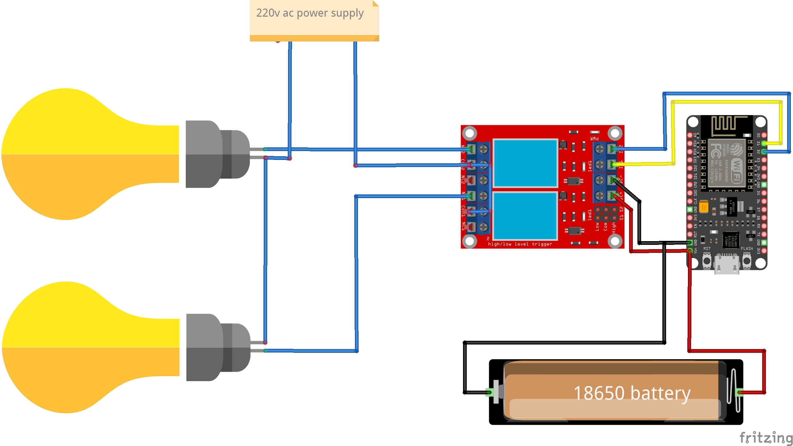

# 🏠 Home Automation System — ESP8266 + Blynk

**Built by:** Dev Gupta | Imagination Guy
**Date: 1April 2026
**Age when built:** 14
**Status:** ✅ Completed

[YouTube Build guide Video](Coming Soon)
[Youtube Channel](https://youtube.com/@imaginationguy27)/
[Instagram](https://www.instagram.com/imagination.guy?igsh=azIybnpoaDlpaHR1)
---

## 📌 The Problem

People constantly forget to turn off fans, lights, and other
appliances when leaving a room. Commercial smart home systems
like Alexa-based setups cost thousands of rupees and require
expensive hardware. I wanted to build the same functionality
for under ₹360 or 3.9usd using components anyone can get locally.

---

## 💡 What I Built

A WiFi-based home automation system using an ESP8266 NodeMCU
microcontroller and a 2-channel relay module. It lets you
control up to 2 home appliances from anywhere in the world
using the free Blynk app on your phone — as long as you have
internet on your phone, it works from any distance, And you 
can add upto 11 relay and controll 11 electrical appliances.


### Key Features
- Control 2 appliances remotely from anywhere
- Works on mobile data — not just home WiFi
- Real-time ON/OFF status feedback in the app
- Auto-reconnects if WiFi drops
- Total build cost under ₹360 or usd 3.9

---

## 🔧 Components Used

| Component | Quantity | Approx. Cost |
|---|---|---|
| ESP8266 NodeMCU v1.0 | 1 | ₹200 |
| 2-Channel Relay Module (5V) | 1 | ₹65 |
| Jumper Wires (M-M, M-F) | ~20 | ₹20 |
| battery + holder | 1 | ₹65 |
| **Total** | | **~₹350** |

---

## ⚡ Circuit Diagram



### Pin Connections

| ESP8266 Pin | Connected To |
|---|---|
| VIN | Relay Module VCC |
| GND | Relay Module GND |
| D1 (GPIO5) | Relay IN1 |
| D2 (GPIO4) | Relay IN2 |

> ⚠️ **Important:** Power the relay module from VIN (5V),
> not from the 3.3V pin. The 3.3V pin cannot supply enough
> current for relay coils and will cause phantom triggering.

---

## 📱 How It Works
```
Phone (Blynk App)
       ↓
  Blynk Cloud Server
       ↓
  ESP8266 (WiFi)
       ↓
  Relay Module
       ↓
  Home Appliance
```

1. You press a button in the Blynk app on your phone
2. Command travels to Blynk's cloud server over internet
3. ESP8266 receives the command via WiFi
4. ESP8266 triggers the corresponding relay channel
5. Relay switches the appliance ON or OFF

---

## 💻 Code

The main code file is in `Home Auromation (code)/Code.ino`

### Libraries Required
Install these via Arduino IDE → Tools → Manage Libraries:
- **Blynk** by Volodymyr Shymanskyy (v1.3.2)
- **ESP8266WiFi** (comes with ESP8266 board package)

### Board Setup in Arduino IDE
1. Go to File → Preferences
2. Add this URL to Additional Boards Manager URLs:
   `http://arduino.esp8266.com/stable/package_esp8266com_index.json`
3. Go to Tools → Board → Boards Manager
4. Search "esp8266" and install

### Configuration
Before uploading, edit these lines in the code:
```cpp
char ssid[] = "YOUR_WIFI_NAME";     // your WiFi network name
char pass[] = "YOUR_WIFI_PASSWORD"; // your WiFi password
char auth[] = "YOUR_BLYNK_TOKEN";   // from Blynk app
```


### Blynk App Setup
1. Download Blynk IoT app (Android/iOS)
2. Create new template → add 2 Button widgets
3. Assign buttons to Virtual Pins: V1, V2, 
4. Set button mode to Switch (not Push)
5. Copy auth token from web → paste in code

---

## 🚧 Challenges & How I Fixed Them

### Challenge 1 — Blynk Version Confusion
**Problem:** Most YouTube tutorials use Blynk Legacy (old version).
The code from those tutorials doesn't work with the new
Blynk IoT platform at all.

**Fix:** Used the official Blynk documentation instead of
YouTube tutorials. Downloaded the correct library version
(1.3.2) directly. Lesson: always check official docs first.

---

### Challenge 2 — Phantom Relay Triggering
**Problem:** Relay was switching ON and OFF randomly without
any command from the app.

**Fix:** Was powering relay module from ESP8266's 3.3V pin.
Relay coils need more current than 3.3V can provide. Switched
to VIN pin (5V from USB). Problem disappeared completely.

---

## 📚 What I Learned

- **Blynk versioning** — Blynk Legacy and Blynk IoT are
  completely different platforms. Code is not interchangeable.
- **Debugging approach** — always check hardware connections
  before debugging software. Wiggle every wire first.

---

## 🔮 Future Improvements (V2 Ideas)

- [ ] Add Touch on/off for mannual option
- [ ] Add OLED display showing which appliances are ON
- [ ] Voice control via Google Assistant
- [ ] Power consumption monitoring per channel
- [ ] Scheduled ON/OFF timers
- [ ] Custom PCB instead of jumper wires

---

## 📁 Repository Structure
```
home-automation-esp8266/
├── README.md
├── code/
│   └── home_automation.ino
├── circuit/
│   └── wiring_diagram.jpg
└── images/
    ├── components.jpg
    ├── final_build.jpg
    └── app_screenshot.jpg
```

---

## 🎥 Full Build Video

Watch the complete build, circuit explanation, and code
walkthrough on YouTube:

**[▶ Watch on YouTube](Coming soon)**

---

## 📖 Build Journal

Full session-by-session documentation of how this project
was built — including every mistake and fix:

**[📖 Read Build Journal](https://docs.google.com/document/d/17wDMTwORUsN3py9V4TQ9A9ReiV7OeHwR_s8Vh4s76JE/edit?usp=sharing)**

---

## 🌐 More Projects

**Portfolio:** [Coming soon]
**YouTube:** [@imaginationguy27](https://youtube.com/@imaginationguy27)
**Instagram:** [https://www.instagram.com/imagination.guy?igsh=azIybnpoaDlpaHR1]

---

## 📄 License

This project is open source under the MIT License.
Feel free to build on it, modify it, or use it in your
own projects. Credit appreciated but not required.

---

*Built with curiosity, a ₹200 chip, and a lot of
debugging — by a 14-year-old maker from Gurugram, India.*
